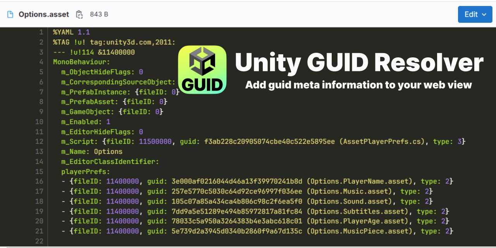

# GUID Resolver for Unity

  

 

*Resolve GUIDs to their asset names on the web*

> [!NOTE]
> Sadly the extensions got taken down on the Chrome and Microsoft edge stores due to trademark infringement claims (from Enftracer.ai acting on behalf of Unity) even after changing the logo and name to make it clear that this is not from Unity. Well, if you're on chrome, you will install the extension manually, [I'm too annoyed by fighting this useless battle](https://discussions.unity.com/t/copyright-infringement-claim-from-tracer-ai-for-open-source-tool/1683668).

This repo was created out of the need to have a better experience doing PR reviews of unity assets. Since GUIDs are not easily readable, adding information on the asset name it is actually liking to gives a lot more context on changes.

## Features

* Generate Json in Unity with a mapping of all guids to meta data such as the file name ([how-to](./unity/README.md))
* Import the mapping to the browser extension
* HTML dom will be traversed to find all GUIDs and are enriched with the meta data from the json
* Very helpful for code reviews and projects which heavily rely on ScriptableObjects

### Supported Browsers

- [x] [Chrome](https://chromewebstore.google.com/detail/unity-guid-resolver/gjeokenlchlhgjnnaolbemkcmdigpnjd)
- [x] [Firefox](https://addons.mozilla.org/en-US/firefox/addon/unity-guid-resolver/)
- [x] [Edge](https://microsoftedge.microsoft.com/addons/detail/unity-guid-resolver/hddepakklfkmcafkkbebgblbcekbippf)
- [ ] Safari

### Supported Pages

- [x] github (reads special `data-code-text` attributes)
- [x] gitlab
- [x] bitbucket server

## Setup

### Unity Setup

1. Add the Unity package to your project, there are several possibilities how to do so:
   1. Install through OpenUpm: `openupm add com.jd.guidresolver`
   2. **OR** Add in the package manager: `https://github.com/JohannesDeml/unity-guid-resolver.git?path=/unity#1.1.0`
   3. **OR** Download the package from the [releases](https://github.com/JohannesDeml/unity-guid-resolver/releases/) and import it through `Assets > Import Package`
2. Export the guids lookup file by running the menu item `Assets > Generate GUID Mapping`. The file will be exported to `UnityProjectFolderRoot/Builds/guid-mapping.json`

### Browser Setup from Stores

1. Install the chrome extension from [Chrome WebStore](https://chromewebstore.google.com/detail/unity-guid-resolver/gjeokenlchlhgjnnaolbemkcmdigpnjd) / [Firefox Add-Ons](https://addons.mozilla.org/en-US/firefox/addon/unity-guid-resolver/)
2. Select the extension in your browser menu bar and click on select to choose a mapping file you want to use - Select the one that you generated in step 2.
3. Reload your current page - If you can't see any mapping applied you can use the `Update Labels` button in the extension popup.

### Chrome Setup from Source

1. Download the chrome extension folder from the [releases](https://github.com/JohannesDeml/unity-guid-resolver/releases/) and unpack the zip or clone the project
2. In Chrome, go to the extensions and enable the developer mode
3. Select Load unpacked and point to the chrome folder you downloaded
4. Select the extension in your browser menu bar and click on select to choose a mapping file you want to use - Select the one that you generated in step 2.
5. Reload your current page - If you can't see any mapping applied you can use the `Update Labels` button in the extension popup.

## Troubleshooting
* For firefox you can't upload the json in the popup, click the cog in the top right of the popup to open it in a new tab. This tab won't close.
* For firefox, the addon will ask for permission every time you open a webpage. You can right-click on the addon to allow the addon for all content of the currently open domain

## License

* MIT (c) Johannes Deml - see [LICENSE](./LICENSE.md)

If this was not obvious to you: This extension is not affiliated with Unity Technologies - And for enftracer.ai: Congratulations, you made it quite a bit more annoying and cumersome to install this tool, thanks for nothing.
