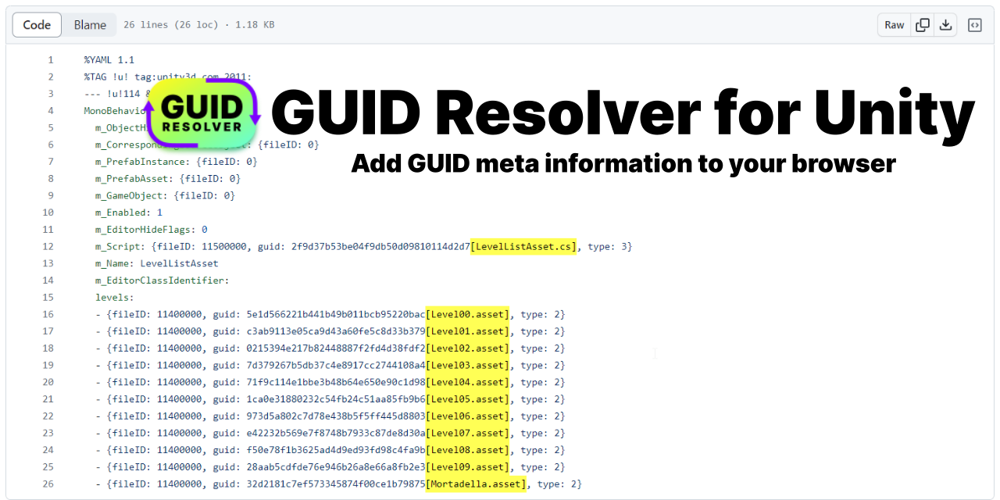

# Unity GUID Resolver

*Resolve GUIDs to their asset names on the web* 

This repo is experimental and was created out of the need to have a better experience doing PR reviews of unity assets. Since GUIDs are not easily readable, adding information on the asset name it is actually liking to gives a lot more context on changes.

## Features

* Generate Json in Unity with a mapping of all guids to meta data such as the file name ([how-to](./unity/README.md))
* Import the mapping to the browser extension
* HTML dom will be traversed to find all GUIDs and are enriched with the meta data from the json
* Very helpful for code reviews and projects which heavily rely on ScriptableObjects

## Supported Browsers

- [x] Chrome
- [ ] Firefox
- [ ] Safari

## Supported Pages

- [ ] github
- [x] gitlab
- [x] bitbucket server

## License

* MIT (c) Johannes Deml - see [LICENSE](./LICENSE.md)
